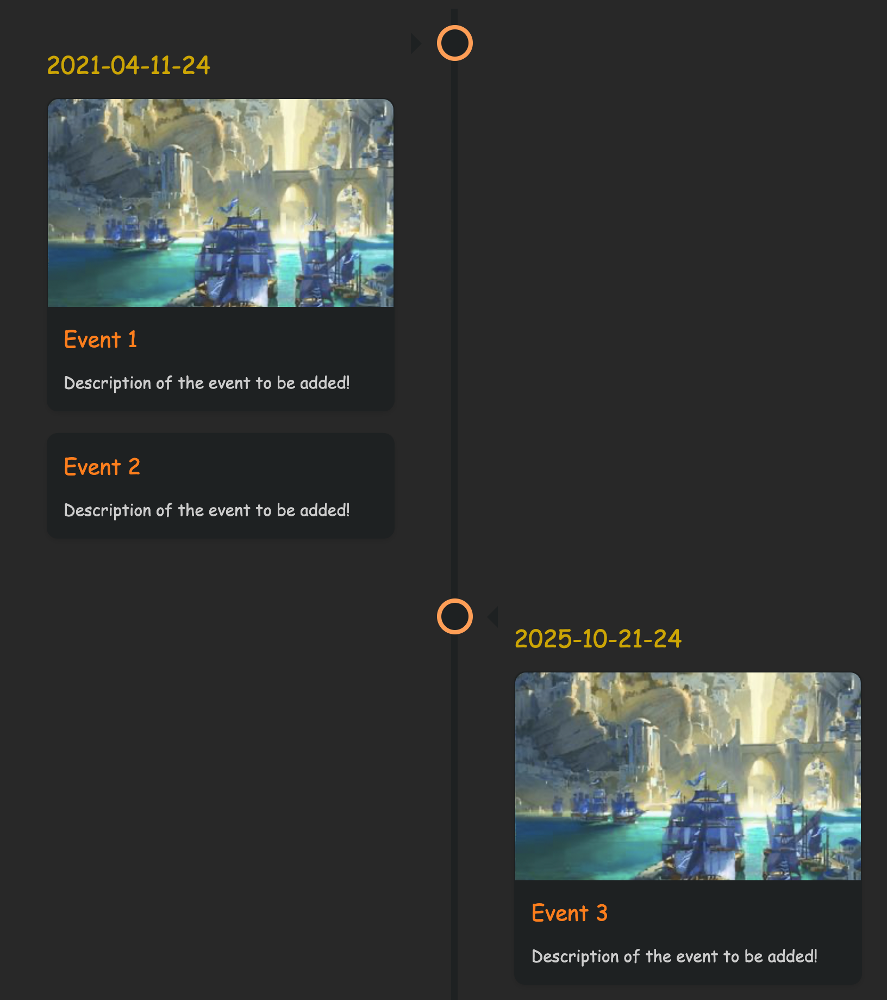

# obsidian Timelines

# UPDATE README

Create a timeline view of all notes with the specified combination of tags

## Adding a timeline

write inside the note where you want to insert the timeline the list of tags that you want to choose separated by `;` (no ; after the last tag) `tag1;tag2;tag3` -> select these -> cmd/ctrl + P `add timeline` command

this creates a timeline of the notes which have the following tags [tag1, tag2, tag3, timeline]

## Marking a note as part of a timeline
1. Add the timeline tag specified in the settings to the YAML tag list 
`tags: [timeline]`

2. Add timeline info to a note as follows (it is hidden when in preview mode to keep notes clean)
```
<span class='ob-timelines' data-date='2025-10-21-24' data-title='Title of Event' 
data-img = 'IMAGE_URL'> Description of the event to be added! </span> 
```
Date format is the following: YYYY-MM-DD-HH (not all elements have to be specified however the order of the elements must be respected as such since it is used for the sorting of the notes)

## Example

